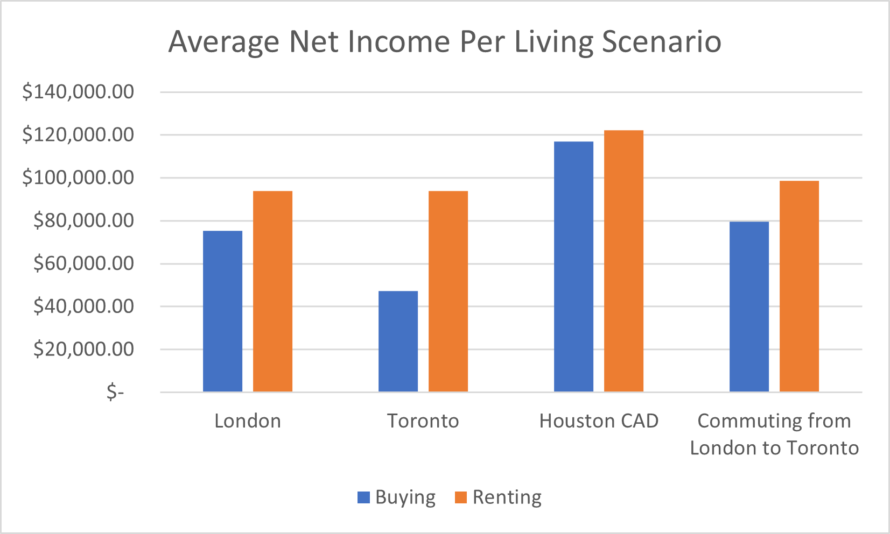
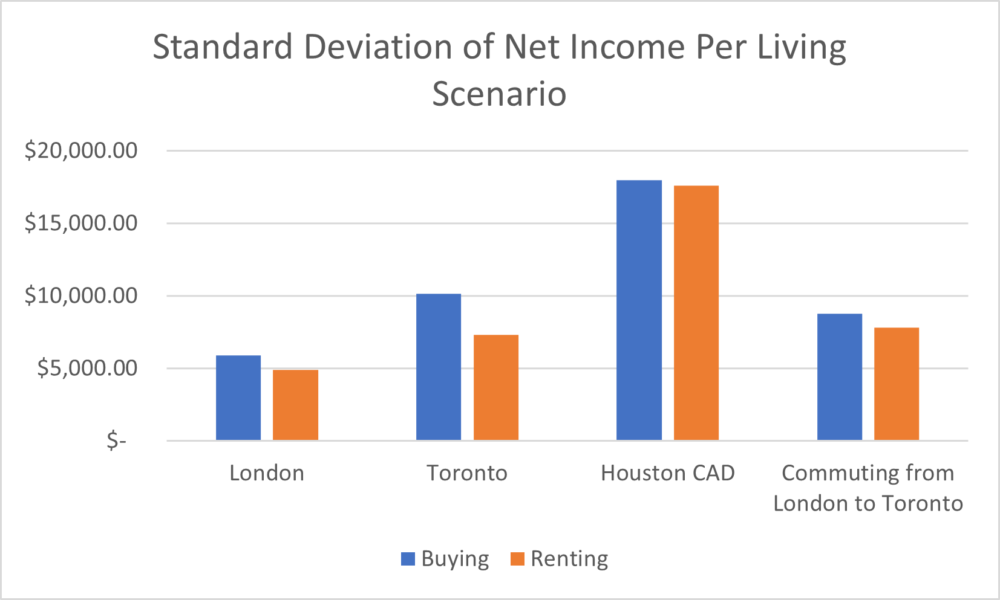
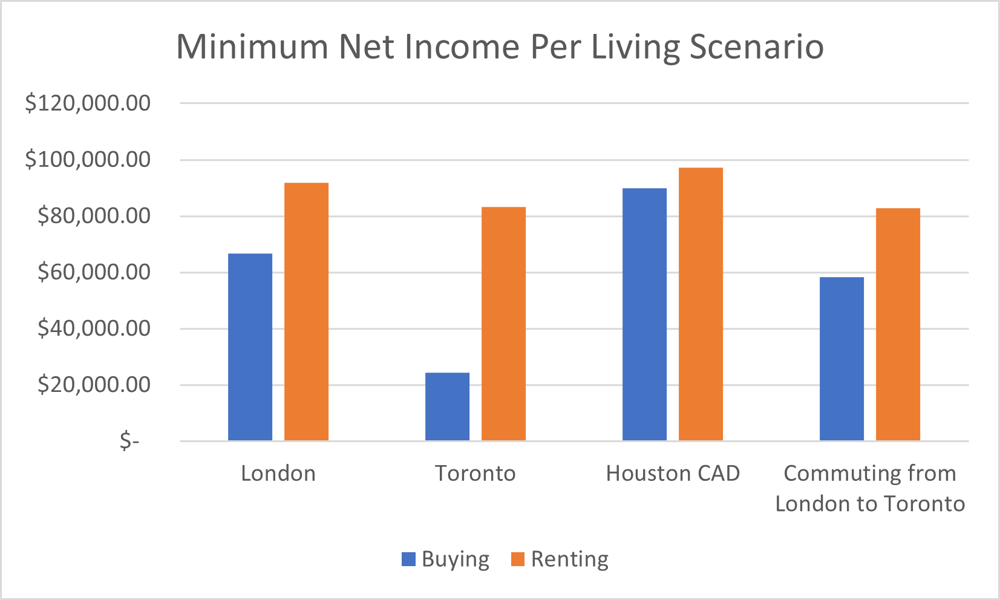
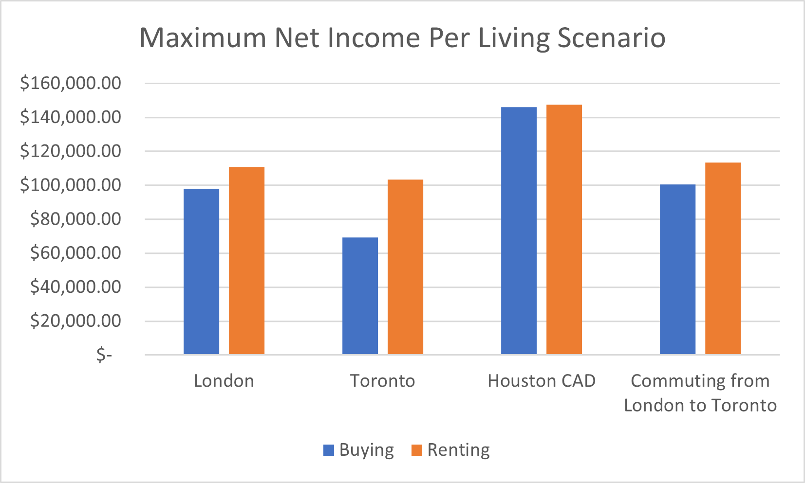

# Evaluating Living Alternatives Using Simulation Modelling in Excel
## Summary
Here I created a decision model for a theoretical person named Hugh who recently completed his Master's Degree and is contemplating where to begin his career to maximize his net income (income after expenses). I used simulation functions in Excel like RAND() to simulate scenarios for his alternatives. Hugh lived in London ON and was deciding between working as a Data Analystin the following cities: London ON, Toronto ON, and Houston TX. Each with different possibilities of renting, buying and commuting (commuting from London to Toronto). Each alternative had different costs of living and salaries for his desired job, and he could not be certain about the actual numbers for anything. For example, if he were to move to Toronto, he can't be certain how much his salary would be before landing a job, therefore I specified a range and simulated the possibilites. After doing research to obtain rough figures for each variable (salaries, house prices, etc.), after 1000 iterations it was deemed that renting a house in Houston was the most financially feasible alternative.

## Data Acquisition
I acquired all of the data from public sources such as glassdoor.com for the salary data. I did not need an actual data set, but instead needed ranges with estimated probabilities, therefore allowing me to simulate possibilities. Full reference list at the end.

## Data Preparation
For the data preparation I needed to assure that the data was in a unit that made sense to perform calculations on. I needed all expenses to be monthly. Further, in my Excel sheet I needed all of the raw figures to be in cells so I could use cell references later in formulas rather than hard coding. This was especially important for simulated data.
Examples of the raw data and randomized figures:

## Data Analysis
 I needed to simulate many of the values that could change in his first year of working or any time. For example, I needed to simulate the USD/CAD foreign exchange (FX) rate using the RANDBETWEEN() function. This function takes a range for your figure and spits out a random number within this range. For the FX rate  I took the minimum and maximum over the last 5 years allowing the simulation to take anything in between. I used the same technique to randomize mortgage rates and gas prices. Tables:

 

The RANDBETWEEN() function follows a uniform distribution, therefore all values are equally probable. For salary data this was not the case. Each city had a fairly large range from glassdoor.com. Each value in the range had a different number of survey responses. I calculated rough probabilities for approximate cutoff values within the range. For example, the London survey responses had the vast majority responding with salaries around the $53,000 range, some responses were over $62,000 and even less were around $72,000. Therefore I assigned probabilities of 85%, 10%, 5% for salaries of $53,000, $62,000, and $72,000 respectively. I then used the RAND() and VLOOKUP() functions in tandem to simulate figures that follow the probability distrubtion. I followed the same proccess for the other two cities. VLOOKUP tables:

Once I had all of my data configured I assembled them into two tables to calculate net income for each scenario. Buying and renting tables ("London-TO stands for commuting from London to Toronto):

I was then able to run the simulation. I did so by creating a data table from Excel's What-If Analysis tab. I than ran 1000 iterations. For each iteration, every cell that has a RAND() or RANDBETWEEN() is running again, producing different figures and therefore a different net income for each scenario. If you open the excel file in this repository you can see that each time you press F9 on your keyboard Excel runs everything again and you get new figures. The first 10 iterations:

After running the simulation I created a summary stats tables to evaluate each alternative. Since the figures change with every move made in Excel I copied and pasted the plain values in a new sheet to get a constant summary stats table. We can see that renting in Houston results in the highest average net income after 1000 iterations. Summary table and visualizations: 

Finally, one thing for the decision maker to consider is what variables would have to change for a different location to have the highest net income. For this question I examined the renting in London and commuting to Toronto for work alternative. This alternative has an average net income of $98,612. One of the expenses that could be decreased is the cost of commuting. For this alternative I assumed Hugh drove a Dodge Ram which had a fuel efficiency of 14.7L/100km. If Hugh drove a car that was more fuel efficient he could significantly decrease his commuting cost. If he got his monthly commuting cost down to $200 his average net income after 1000 iterations would be $107,043. This is quite close to $122,289 average for the renting in Houston alternative. The commuting alternative also has much lower standard deviation. Summary table:

## Conclusion
In conclusion, simulation modelling in Excel was an effective method to evaluate alternatives for a decision maker. Though something to consider is this model only evaluated quantitative aspects of each alternative, it is important to consider qualitative aspects as well. Maybe someone in Hugh's situation has a family and moving would affect his family memebers. That is only one possibility, the conclusion is that though a model is useful for making decisions under uncertainty it's important to look at the bigger picture.

## References
 1 Glassdoor. (n.d.). Data Analyst Salaries. Retrieved December 12, 2023, from https://ww
w.glassdoor.ca/Salaries/data-analyst-salary-SRCH_IM979_KO0,12.htm

2 WowA. (n.d.). London Housing Market. Retrieved [insert date], from https://wowa.ca/london-housing-market

3 Zumper. (n.d.). Rent Research in London, ON. Retrieved December 12, 2023, from https://www.zumper.com/rentresearch/london-on

4 Livingcost. (n.d.). London, ON, Canada - Cost of Living. Retrieved from https://livingcost.org/cost/canada/on/london

5 Glassdoor. (n.d.). Data Analyst Salaries. Retrieved December 12, 2023, from https://www.glassdoor.ca/Salaries/dataanalyst-salary-SRCH_IM976_KO0,12.ht

6 fueleconomy.gov. (n.d.). 2010 Dodge Ram 1500 Pickup. Retrieved December 12, 2023, from 
https://www.fueleconomy.gov/feg/bymodel/2010_Dodge_Ram_1500_Pickup.shtml

7 16 MPG = 14.7 L/100 km

8 Zumper. (n.d.). Rent Research in Toronto, ON. Retrieved December 12, 2023, from https://www.zumper.com/rentresearch/toronto-on

9 WowA. (n.d.). Toronto Housing Market. Retrieved December 12, 2023, from https://wowa.ca/toronto-housing-market

10 U-Haul. (n.d.). U-Haul: Your Moving and Storage Resource. Retrieved December 13, 2023, from https://www.uhaul.com/

11 Fuelson. (n.d.). How Many MPG Does a U-Haul Truck Get? Retrieved December 12, 2023, from 
https://fuelson.com/blog/how-many-mpg-does-a-u-haul-truck-get

12 Nina Out and About. (n.d.). Cost of Living in Toronto: Breakdown & Tips. Retrieved from https://ninaoutandabout.ca/costof-living-toronto/

13 Glassdoor. (n.d.). Data Analyst Salaries. Retrieved December 12, 2023, from https://www.glassdoor.ca/Salaries/dataanalyst-salary-SRCH_IM394_KO0,12.htm

14 Zumper. (n.d.). Rent Research in Houston, TX. Retrieved Dec 12, 2023, from https://www.zumper.com/rentresearch/houston-tx

15 Redfin. (n.d.). Houston, TX Housing Market. Retrieved Dec 12, 2023, from 
https://www.redfin.com/city/8903/TX/Houston/housing-market

16 WowA. (n.d.). Toronto Housing Market. Retrieved December 12, 2023, from https://wowa.ca/toronto-housing-market

17 Finder. (n.d.). Gas Prices. Retrieved December 12, 2023, from https://www.finder.com/gasprices#:~:text=The%20national%20average%20gas%20price%20this%20week%20is,or%20%240.26%20a%20gallon%20le
ss%20expensive%20than%20today.

18 1 Litre = 0.22 Gallons

19 Livingcost. (n.d.). Houston, TX, United States - Cost of Living. Retrieved Dec 12, 2023 from 
https://livingcost.org/cost/united-states/tx/houston

20 Consumer Financial Protection Bureau (CFPB). (n.d.). What Is Mortgage Insurance and How Does It Work? Retrieved 
December 12, 2023, from https://www.consumerfinance.gov/ask-cfpb/what-is-mortgage-insurance-and-how-does-it-work-en-1953/

21 Scotiabank. (n.d.). What is mortgage insurance and how does it work? Retrieved Dec 12, 2023, from 
https://www.scotiabank.com/ca/en/personal/advice-plus/features/posts.what-is-mortgage-insurance-and-how-does-itwork.html#:~:text=Mortgage%20default%20insurance%20works%20out%20to%20cost%20an,value%20of%20the%20prope
rty%20you%20want%20to%20buy%29.

22 WowA. (n.d.). Canada Mortgage Rates History. Retrieved December 12, 2023, from https://wowa.ca/canada-mortgagerates-history

23 ^Forbes. (n.d.). Mortgage Interest Rates Forecast. Retrieved December 12, 2023, from 
https://www.forbes.com/advisor/mortgages/mortgage-interest-rates-forecast/

24 Glassdoor. (n.d.). Registered Nurse Salaries. Retrieved December, 12, 2023, from 
https://www.glassdoor.ca/Salaries/registered-nurse-salary-SRCH_IM979_KO0,16.htm
